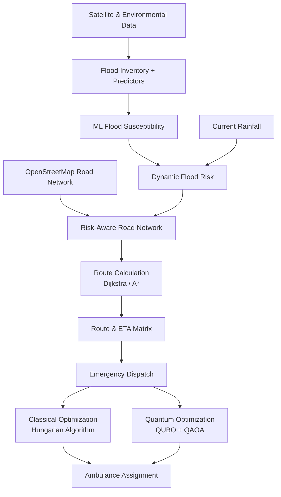

# Orion — Flood Risk and Emergency Routing

A research project that combines **remote sensing, geospatial analysis, machine learning, rainfall-based risk modelling, and graph-based pathfinding** to support flood-aware emergency routing in Dakshina Kannada, Karnataka, India.


The project follows a simple idea:

> **Use historical satellite observations to learn where flooding is more likely, combine that with current rainfall, transfer the resulting risk onto roads, and find safer routes through the road network.**

A small **quantum optimisation experiment** is then built on top of the routing results to study emergency vehicle-to-incident assignment.

---

## 1. How the Project Works

The complete backend flow can be understood as:

```text
Satellite + environmental data
            ↓
      Flood observations
            ↓
      Training dataset
            ↓
     ML susceptibility model
            ↓
  District-wide susceptibility map
            ↓
     Real road network (OSM)
            ↓
  Risk assigned to road segments
            ↓
       Current rainfall
            ↓
       Dynamic flood risk
            ↓
   Risk-aware road network
            ↓
       Dijkstra / A*
            ↓
       Safer route + ETA
            ↓
   Emergency dispatch matrix
            ↓
       Quantum experiment
```

The important part is that the machine-learning model and the pathfinding algorithm solve **different problems**.

- **Machine learning:** estimates spatial flood susceptibility.
- **Rainfall model:** determines how strongly that susceptibility is activated at a given time.
- **Pathfinding:** determines how to travel through the resulting road network.
- **Quantum optimisation:** investigates how emergency assignments can be formulated as an optimisation problem.

---

# 2. Data Collection

The first stage is to collect the environmental and geographic data required to construct the flood model.

### Sentinel-1 SAR

Sentinel-1 GRD imagery is used to identify surface water during the monsoon. Both **VV and VH polarizations** are used.

The project uses selected descending-pass observations over the study area during the monsoon seasons of 2024 and 2025.

SAR is particularly useful because it can observe the Earth's surface despite monsoon cloud cover.

### Other environmental datasets

The project combines Sentinel-1 with several geospatial datasets:

| Dataset | Purpose |
|---|---|
| Sentinel-1 | Historical flood observations |
| JRC Global Surface Water | Remove permanent water |
| SRTM DEM | Elevation and terrain variables |
| MERIT Hydro | HAND, drainage and hydrological variables |
| CHIRPS | Long-term rainfall climatology |
| OpenStreetMap | Road network and geographic features |
| Open-Meteo / ERA5 | Current and historical rainfall |
| WorldTides | Tide observation for contextual information |

The study area is **Dakshina Kannada district, Karnataka**, covering the district's road network and nine taluks.

---

# 3. Creating the Flood Dataset

The raw satellite imagery cannot be used directly as the ML target. It first needs to be converted into an estimate of where transient flooding was observed.

## 3.1 SAR preprocessing

Each Sentinel-1 image is processed using a focal median filter to reduce speckle noise.

Water is then detected using both SAR polarizations:

```text
VV < -16 dB
AND
VH < -22 dB
```

This produces a water mask for each satellite pass.

## 3.2 Removing permanent water

Not every water pixel represents a flood. Rivers, lakes, estuaries and other permanent water bodies therefore need to be removed.

The JRC Global Surface Water dataset is used for this purpose. Areas with approximately **80% or greater historical water occurrence** are treated as permanent water.

## 3.3 Removing normally wet areas

Dry-season Sentinel-1 observations from January–February are used to determine whether an area is normally dry.

This helps distinguish:

```text
Permanent / normal water
        from
Temporary monsoon inundation
```

## 3.4 Flood-frequency map

For every qualifying monsoon pass, the project determines whether a pixel was observed as transiently flooded.

The observations are combined into a flood-frequency value:

```text
Flood frequency Φ(x)
=
number of flood observations at x
---------------------------------
number of qualifying SAR passes
```

Therefore:

```text
Φ(x) = 0   → flooding was not observed
Φ(x) = 1   → flooding was observed on every qualifying pass
```

This is an **observed flood-frequency inventory**, not a complete record of all flooding. A satellite may simply miss an event between two revisits.

---

# 4. Building the ML Training Data

Once the flood inventory is available, the next step is to describe each location using environmental predictors.

The initial candidate feature set contains:

```text
elevation
slope
aspect
curvature
HAND
TWI
SPI
distance to river
drainage density
NDVI
annual rainfall
LULC
```

These features describe the terrain, drainage conditions, vegetation and rainfall characteristics of each location.

## 4.1 Final model features

The primary model uses nine features:

```text
elevation
slope
aspect
curvature
HAND
TWI
distance to river
drainage density
annual rainfall
```

SPI is removed after multicollinearity analysis. NDVI and LULC are excluded from the primary model because the flood labels themselves come from SAR observations.

This is an important research decision: vegetation can affect how easily SAR detects water, meaning the model could otherwise learn **sensor visibility** rather than actual flood susceptibility.

## 4.2 Selecting flood and non-flood samples

Flood samples are locations where:

```text
Φ(x) >= 0.05
```

Non-flood samples are locations where:

```text
Φ(x) = 0
AND
at least 120 m away from observed flood pixels
```

Both classes are restricted to a terrain-matched lowland domain:

```text
elevation <= 280 m
HAND <= 80 m
```

The training dataset targets approximately:

```text
1500 flood samples
1500 non-flood samples
```

Missing predictor values are removed before model training.

The final table is stored as:

```text
data/processed/training.parquet
```

---

# 5. Training the Flood Susceptibility Model

The training data is used to compare two tree-based ML models:

- Random Forest
- XGBoost

The primary training setup uses a **70/30 stratified train-test split** with `random_state = 42`, along with 5-fold cross-validation on the training data.

The current primary model is **XGBoost**.

The audited held-out performance is approximately:

```text
ROC-AUC: 0.9625
5-fold CV ROC-AUC: 0.953 ± 0.009
```

The model outputs a susceptibility score for a location:

```text
S(x) = flood susceptibility at location x
```

This score represents the model's learned spatial relationship between the environmental predictors and the observed flood inventory.

It is important to note that **S(x) is not water depth**.

---

# 6. Model Validation and Explanation

The project does not rely only on a random train-test split because nearby geographic locations can be highly correlated.

Three levels of validation are used:

### Random validation

A conventional stratified 70/30 split.

### Spatial-block validation

The study area is divided into approximately `0.05°` spatial blocks. Entire blocks are held out during validation to reduce spatial leakage.

Current audited ROC-AUC:

```text
0.9474
```

### Geographic transfer validation

A coastal region is withheld and the model is evaluated on that unseen geography.

Current audited ROC-AUC:

```text
0.8594
```

This provides a more realistic test of whether the model can transfer to locations that were not represented in its training samples.

## Calibration

The XGBoost output is additionally calibrated using **isotonic calibration** so that the score can be interpreted more meaningfully as a probability-like quantity.

## SHAP explainability

SHAP is used to determine which features contribute most strongly to an individual prediction.

For a location, the system can therefore retrieve:

```text
coordinates
      ↓
predictor values
      ↓
XGBoost prediction
      ↓
SHAP feature contributions
```

This makes the susceptibility model explainable at individual locations rather than treating it as a black box.

---

# 7. Creating the District Susceptibility Map

After training, the serialized XGBoost model is applied across the study area.

A 120 m predictor raster contains the nine features expected by the model.

```text
120 m predictor stack
        +
trained XGBoost model
        ↓
Susceptibility prediction for every pixel
        ↓
District susceptibility raster
```

The resulting raster represents the **static spatial component** of flood risk.

The predictor-band order is stored separately so that the raster values are always passed to the model in the correct feature order.

---

# 8. Bringing in the Road Network

A susceptibility map is useful for understanding the landscape, but emergency vehicles travel on roads.

OpenStreetMap is therefore converted into a directed drivable graph.

```text
OpenStreetMap
     ↓
Road network
     ↓
Graph nodes + directed edges
     ↓
Travel time for each edge
```

The current audited graph contains approximately:

```text
25,407 nodes
59,501 directed edges
```

For every road edge, the susceptibility raster is sampled around the edge midpoint to obtain an edge-level susceptibility value:

```text
Raster susceptibility S(x)
          ↓
Road edge midpoint
          ↓
Edge susceptibility S(e)
```

This creates the bridge between the ML model and the pathfinding algorithm.

---

# 9. Adding Current Rainfall

The susceptibility map is static. Flood conditions, however, change with rainfall.

Current hourly rainfall is retrieved from Open-Meteo using representative locations across the district:

- Mangaluru coast
- Moodbidri north
- Bantwal / Nethravathi
- Puttur interior
- Sullia Ghats

For each location, antecedent rainfall is calculated over multiple windows, including:

```text
6 hours
24 hours
72 hours
```

These rainfall measurements are converted into a single rainfall trigger:

```text
T(t) = rainfall activation at time t
```

The project then combines the static susceptibility and current rainfall:

```text
R(e,t) = S(e) × T(t)
```

where:

- `S(e)` is the static susceptibility of a road edge
- `T(t)` is the current rainfall trigger
- `R(e,t)` is the resulting dynamic edge risk

WorldTides can also provide tide observations, but in the current implementation **tide is contextual information and is not part of the rainfall trigger calculation**.

---

# 10. Flood-Aware Routing

Once every road edge has a dynamic risk value, the normal road graph is modified.

Conceptually:

```text
OSM road graph
      ↓
Edge susceptibility
      ↓
Current rainfall
      ↓
Dynamic edge risk
      ↓
Risk-adjusted graph
```

Depending on the risk level, an edge can either:

1. receive an additional traversal penalty, or
2. be treated as blocked when the risk exceeds the configured threshold.

The routing cost therefore accounts for both:

```text
Travel time
     +
Flood risk
```

The project uses two shortest-path algorithms:

### Dijkstra

Provides the standard shortest-path solution using the current edge costs.

### A*

Uses a geographic heuristic to search the graph more efficiently while solving the same routing problem.

The result is a flood-aware route and its estimated travel time.

---

# 11. Emergency Routing and Dispatch

The routing system can calculate travel times between hospitals and incident locations.

The process is:

```text
Hospitals
    +
Incident locations
    ↓
Flood-aware routing
    ↓
Hospital × incident ETA matrix
```

This matrix can then be used to determine which hospital or emergency resource can reach each incident most efficiently under the current road conditions.

The backend also supports arbitrary emergency coordinates by mapping them to the nearest valid road-network node before routing.

The current research setup contains **19 hospital routing origins** across nine taluks and **13 scenario points**.

These locations represent routing origins/scenarios for the research prototype; they should not be interpreted as real-time information about ambulance availability, hospital capacity, emergency-department status or bed availability.

---

# 12. Overall Backend Architecture

The complete flow can therefore be represented with the following architecture diagram:



The key transition is:

```text
ML prediction
     ↓
road-edge susceptibility
     ↓
rainfall activation
     ↓
dynamic road risk
     ↓
pathfinding
```

That is the core of the project.

---

# 13. Quantum Optimisation

The quantum component is a smaller research branch built **after** the classical routing system.

The routing system first produces a travel-time matrix such as:

```text
             Incident 1   Incident 2   Incident 3
Hospital 1      ...          ...          ...
Hospital 2      ...          ...          ...
Hospital 3      ...          ...          ...
```

This is converted into a small **3×3 assignment problem**.

Each possible hospital-to-incident assignment is represented by a binary variable:

```text
x[i,j] = 1 if hospital i is assigned to incident j
         0 otherwise
```

The assignment constraints are encoded into a QUBO objective. The resulting problem uses **9 binary variables / qubits**.

Two approaches are then compared:

```text
Travel-time matrix
       ↓
   3×3 QUBO
    ↙     ↘
QAOA       Hungarian algorithm
  ↓             ↓
Quantum      Exact classical
solution       solution
    \          /
     Verification
```

The Hungarian algorithm acts as the exact classical reference, while QAOA is used to investigate whether the quantum formulation reaches the same ground-state assignment.

This experiment is intended as a **proof-of-formulation and verification study**, not as a claim of quantum advantage.

---

# 14. Project Structure

```text
flood-risk-main/
│
├── floodrisk/
│   ├── config.py              # Shared configuration
│   ├── sar.py                 # SAR flood inventory
│   ├── predictors.py          # Environmental predictors
│   ├── sampling.py            # Training sample generation
│   ├── routing.py             # Dijkstra / A* routing
│   ├── live.py                # Rainfall and live risk logic
│   ├── explain.py             # SHAP and point explanations
│   ├── quantum.py             # QUBO / QAOA formulation
│   └── tools.py               # Backend tool functions
│
├── scripts/
│   ├── build_training_table.py
│   ├── train_susceptibility.py
│   ├── export_predictor_stack.py
│   ├── build_road_graph.py
│   ├── export_multi_routes.py
│   └── quantum_dispatch.py
│
├── data/
│   ├── raw/
│   └── processed/
│
├── models/                    # Trained model artifacts
├── web_assets/                # Raster/model assets used by the backend
├── tests/                     # Methodological and functional tests
├── docs/                      # Research documentation and audits
├── paper/                     # Research manuscript
├── flood-risk-app/            # Backend application/API
│
├── Makefile
├── requirements.txt
└── README.md
```

---

# 15. Main Technologies

| Area | Technology |
|---|---|
| Remote sensing | Google Earth Engine, Sentinel-1 |
| Geospatial processing | Earth Engine, Rasterio, GeoPandas, Shapely |
| Machine learning | XGBoost, scikit-learn |
| Explainability | SHAP |
| Road network | OpenStreetMap, OSMnx, NetworkX |
| Routing | Dijkstra, A* |
| Weather | Open-Meteo / ERA5 |
| Quantum optimisation | Qiskit / QAOA |
| Backend API | FastAPI |
| Data processing | Python, pandas, NumPy |

---

# 16. Running the Research Pipeline

The repository contains Makefile targets for rebuilding the main research artifacts.

The conceptual order is:

```text
build training data
        ↓
train model
        ↓
export predictor stack
        ↓
build susceptibility map
        ↓
build road graph
        ↓
export routing matrices
        ↓
run quantum dispatch experiment
```

The exact commands and configuration are defined in the repository's `Makefile` and project configuration files.

A typical development environment uses Python 3 with the dependencies listed in:

```text
requirements.txt
```

Google Earth Engine authentication is required for the stages that acquire or process Earth Engine datasets.

---

# 17. Important Research Notes

### Susceptibility is not flood depth

The ML model estimates relative spatial susceptibility from the available observations and predictors. It does not estimate water depth, flow velocity or vehicle-fording capability.

### SAR observations are incomplete

The flood inventory only contains flooding that was observable during satellite revisits. Flooding occurring between observations can be missed.

### Rainfall is an activation model

The rainfall trigger is a simplified way of introducing temporal conditions into the static susceptibility model. It is not a full hydrodynamic flood simulation.

### Road blocking is a modelling decision

When an edge is blocked, that decision comes from the project's risk threshold. It is not based on direct measurements of water depth on that road.

### Quantum results are experimental

The QAOA component demonstrates a quantum formulation of the dispatch problem. The current small problem size is not intended to demonstrate practical quantum advantage.

---

# 18. Core Research Contribution

The project connects several normally separate stages into one pipeline:

```text
Remote sensing
      ↓
Observed flood inventory
      ↓
Machine-learning susceptibility
      ↓
Spatial risk map
      ↓
Real road network
      ↓
Rainfall-driven dynamic risk
      ↓
Flood-aware pathfinding
      ↓
Emergency travel-time optimisation
      ↓
Quantum assignment formulation
```

The central contribution is therefore not simply the use of XGBoost, Dijkstra, A*, or QAOA individually.

It is the **integration of a spatial ML flood-susceptibility model with a dynamic rainfall trigger and a real transportation graph**, allowing environmental risk estimates to directly influence emergency routing.

---

# 19. Current Primary Results

The current audited research pipeline reports approximately:

| Metric | Result |
|---|---:|
| Held-out XGBoost ROC-AUC | **0.9625** |
| 5-fold CV ROC-AUC | **0.953 ± 0.009** |
| Spatial-block ROC-AUC | **0.9474** |
| Geographic transfer ROC-AUC | **0.8594** |
| OSM graph nodes | **25,407** |
| OSM directed edges | **59,501** |
| Hospital routing origins | **19** |
| Scenario points | **13** |
| Quantum assignment size | **3 × 3** |
| QUBO variables / qubits | **9** |

These values describe the current audited research configuration and should be treated as experiment-specific rather than universal system guarantees.

---

# 20. License and Research Use

This repository is intended primarily as an academic/research project. Dataset providers and external services retain their respective terms and licenses.
